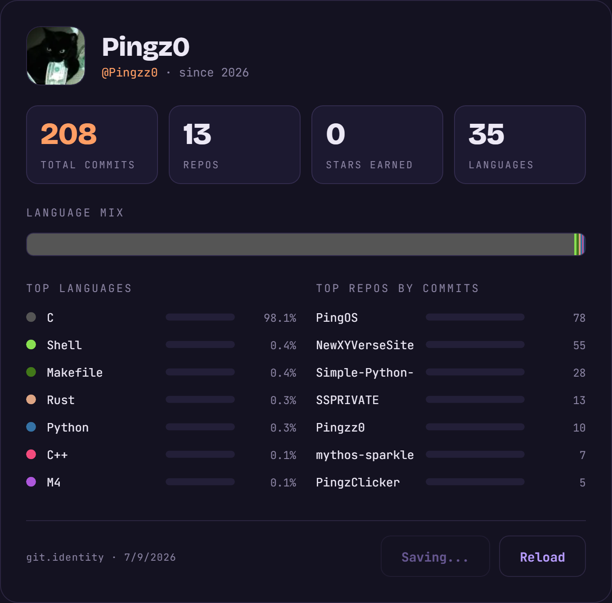

# 💫 About Me:
Pingz0 Germany-based Minecraft developer focused on C++, TypeScript. I mainly build and run my own server: xyverse.eu Most of my time is spent playing and developing Minecraft Plugins. 

## 🌐 Socials:
  

# 💻 Tech Stack:
             
# 📊 GitHub Stats:
 
 

<!-- Proudly created with GPRM ( https://gprm.itsvg.in ) -->
